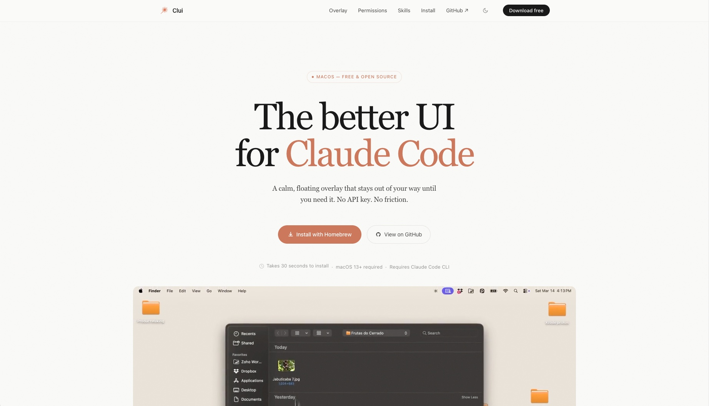

# Clui - The better UI for Claude Code

> [!NOTE] 
> This is a forked project from [Lucas Couto](https://github.com/lcoutodemos)'s [Clui CC](https://github.com/lcoutodemos/clui-cc) with some of my additions!

It's a lightweight, transparent desktop overlay for [Claude Code](https://docs.anthropic.com/en/docs/claude-code) on macOS. Clui wraps the Claude Code CLI in a floating pill interface with multi-tab sessions, a permission approval UI, voice input, and a skills marketplace.


## Features

- **Floating overlay** - transparent, click-through window that stays on top. Toggle with `⌥ + Space` (fallback: `Cmd+Shift+K`).
- **Multi-tab sessions** - each tab spawns its own `claude -p` process with independent session state.
- **Permission approval UI** - intercepts tool calls via PreToolUse HTTP hooks so you can review and approve/deny from the UI.
- **Conversation history** - browse and resume past Claude Code sessions.
- **Skills marketplace** - install plugins from Anthropic's GitHub repos without leaving Clui.
- **Voice input** - local speech-to-text via Whisper (required, installed automatically).
- **File & screenshot attachments** - paste images or attach files directly.
- **Dual theme** - dark/light mode with system-follow option.

> [!IMPORTANT]
> Clui is not yet notarized with Apple. macOS Gatekeeper may block the first launch. See the install sections below for the workaround. Notarization is coming soon.

## Install

### Website

Visit **[clui.app](https://clui.app)** to install via Homebrew or download the `.dmg` directly, it auto-detects your Mac's architecture.

<a href="https://clui.app">
  
</a>

### Homebrew

```bash
brew install --cask Youssef2430/clui/clui
```

### DMG Download

Download the latest `.dmg` from [Releases](https://github.com/Youssef2430/clui/releases):

- **Apple Silicon (M1+):** `Clui-x.x.x-arm64.dmg`
- **Intel:** `Clui-x.x.x.dmg`

> **First launch:** macOS may block the app because it's not notarized. Go to **System Settings > Privacy & Security > Open Anyway**, or run:
> ```bash
> xattr -cr /Applications/Clui.app
> ```
> You only need to do this once.

## Prerequisites

- **macOS 13+** (Ventura or later)
- **Claude Code CLI** - install with `npm install -g @anthropic-ai/claude-code` and authenticate by running `claude`

> **No API keys or `.env` file required.** Clui uses your existing Claude Code CLI authentication (Pro/Team/Enterprise subscription).

## How It Works

```
UI prompt → Main process spawns claude -p → NDJSON stream → live render
                                         → tool call? → permission UI → approve/deny
```

See [`docs/ARCHITECTURE.md`](docs/ARCHITECTURE.md) for the full deep-dive.

<details>
<summary><strong>Development</strong></summary>

```bash
git clone https://github.com/Youssef2430/clui.git
cd clui
npm install
npm run dev
```

Renderer changes update instantly. Main-process changes require restarting `npm run dev`.

### Commands

| Command | Purpose |
|---------|---------|
| `npm run dev` | Start in dev mode with hot reload |
| `npm run build` | Production build (no packaging) |
| `npm run dist` | Package as macOS `.app` into `release/` |
| `npm run dist:dmg` | Build DMG + ZIP for both architectures |
| `npm run doctor` | Run environment diagnostic |

</details>

## Troubleshooting

For setup issues and recovery commands, see [`docs/TROUBLESHOOTING.md`](docs/TROUBLESHOOTING.md).

Quick self-check:

```bash
npm run doctor
```

## Known Limitations

- **macOS only** - transparent overlay, tray icon, and node-pty are macOS-specific.
- **Requires Claude Code CLI** - Clui is a UI layer, not a standalone AI client.

## Q&A
> Why didn't you just contribute to the original project ?
>
> > I just got excited about the project and at first wanted a better way to install it and keep up with its versions but I ended up using it and wanting to add some features so I figured I'd use it as a base conva to build on top!
